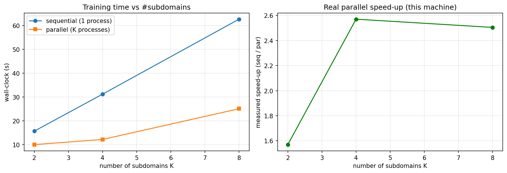

# Domain Decomposition Accelerated Neural Networks (DD-ANNs)

### Summer Research Internship Program (SRIP) 2026 — IIT Gandhinagar

**Students:** Chitiveli Hemcharan Varma (IIT Gandhinagar) · Krishna (VIT Vellore)
**Supervisor:** Dr. Abhinav Jha
**Institute:** Indian Institute of Technology Gandhinagar

> Combining Physics-Informed Neural Networks (PINNs) with classical domain
> decomposition to build **scalable, parallel** mesh-free PDE solvers — aimed at
> the electrostatic models of computational chemistry (Linearized
> Poisson–Boltzmann, COSMO).

---

## Project overview

Physics-Informed Neural Networks solve PDEs by minimizing the equation residual
through automatic differentiation, with no mesh. They are flexible but suffer
from **spectral bias** (slow to learn high frequencies) and grow expensive as the
domain or solution complexity increases.

This project attacks both problems with **domain decomposition (DD)**: split the
domain into subdomains, train a small PINN on each, and couple them with a
classical **overlapping Schwarz** iteration that exchanges interface data between
neighbours. Each subdomain is a smaller, lower-frequency, *independent* problem —
so DD both mitigates spectral bias **and** exposes parallelism: the subdomains
can train simultaneously on separate cores or nodes.

The ultimate application is solving the **Linearized Poisson–Boltzmann (LPB)**
equation and the **COSMO** model used in biomolecular simulation and solvation-
energy calculations, where domains are large and a single global PINN does not
scale.

---

## Repository structure

```
Phase1_PINN_1D/
  dd_parallel_mp.py          # TRUE-parallel K-subdomain DD (torch.multiprocessing)
Phase2_PINN_2D/
  dd_parallel_mp_2d.py       # TRUE-parallel K-strip DD (torch.multiprocessing)
References/                  # key reference papers
README.md
```

Each script is **self-contained**: it implements vanilla PINN and DD-PINN from
scratch, runs them under matched capacity and a matched optimization budget, and
prints the **real measured** results — no cached or hand-edited numbers. The
domain is split into `K` overlapping subdomains, one OS process per subdomain;
`K` defaults to **2**.

---

## Methods compared

| | Method | Idea |
|---|---|---|
| **A** | **Vanilla PINN** | one global network over the whole domain |
| **B** | **DD-PINN** | split the domain into **overlapping** subdomains, a smaller PINN on each, coupled by an **overlapping Schwarz** outer iteration that exchanges interface (Dirichlet) data each round |

Both methods enforce boundary conditions **exactly** with a distance function
(`u = lift + (distance)·Nθ`), so the loss is the pure PDE residual — there is no
boundary-penalty term to balance.

**Why the overlap is essential.** With a hard BC, a subdomain network evaluated
*at its own boundary* returns the imposed value by construction. If two
subdomains only *touched* (no overlap), the transmitted interface value would be
self-referential and could never update — the classic ill-posedness of
non-overlapping Dirichlet–Dirichlet coupling. With overlap, each subdomain reads
its interface value from the **neighbour's interior** (a genuine PDE value), so
the Schwarz iteration converges **geometrically — faster with larger overlap**.

---

## Results (real, reproduced in the notebooks)

All numbers are measured by the notebooks on CPU, under matched network capacity
and a matched optimization budget.

### 1D Poisson  −u″ = f on [0,1]

One width-47 network vs. two width-32 networks (≈4.7k vs ≈4.4k params), 6000
optimization steps each.

| Problem | Vanilla L2 | DD L2 | Vanilla train | DD train (1 process) |
|---|---|---|---|---|
| sin(πx) | 1.9e-03 | 1.4e-03 | 8.7 s | 15.3 s |
| x(1−x) | 1.1e-03 | 1.6e-03 | 8.5 s | 15.0 s |
| **sin(4πx)** *(high-freq)* | **2.4e+00** | **5.3e-01** | 8.6 s | 15.3 s |
| eˣ | 3.4e-04 | 1.0e-03 | 8.5 s | 15.1 s |

DD matches the global PINN on the smooth problems and is **~5× more accurate on
the high-frequency case**, where a global PINN is crippled by spectral bias (each
subdomain sees a lower effective frequency). The DD times here are **single-process**
(both subdomains trained on one core, so naturally ~2× vanilla); the **real measured
parallel** times are in the [next section](#real-parallel-execution-measured-not-inferred).


### 2D Poisson  −Δu = f on [0,1]²

One `2-64-64-64-1` network vs. two `2-64-64-1` strips (≈8.6k vs ≈8.8k params),
4500 steps (vanilla) vs. 12 Schwarz rounds × 400 steps (DD).

| Problem | Vanilla L2 | DD L2 | Vanilla train | DD train (1 process) |
|---|---|---|---|---|
| sin(πx)sin(πy) | 1.2e-04 | 1.5e-04 | 43.6 s | 48.1 s |
| sin(πx)sin(3πy) | 2.4e-02 | 2.1e-02 | 43.9 s | 48.9 s |

DD reproduces the global PINN's accuracy while each strip is half the domain and
independent. Times here are **single-process**; the **real measured parallel**
speed-up is in the next section.


---

## Real parallel execution (measured, not inferred)

The tables above report **single-process** training times only — real, but
sequential. **Every number in this section is a true measured parallel run**, not a
`max`-based estimate. [`dd_parallel_mp.py`](Phase1_PINN_1D/dd_parallel_mp.py) and
[`dd_parallel_mp_2d.py`](Phase2_PINN_2D/dd_parallel_mp_2d.py) spawn **one actual OS
process per subdomain** via `torch.multiprocessing`, run them **simultaneously**, and
wrap a real `time.perf_counter()` around the concurrent section
(`speed-up = sequential / parallel`).

> **Proof it really runs in parallel:** a measured `par < seq` is impossible unless
> the work genuinely overlapped — e.g. 1D K=4 goes **seq 32.3 s → par 14.2 s**, and
> 2D K=2 goes **seq 48.9 s → par 28.4 s**. The discarded "parallel-equivalent"
> estimate (`max` over subdomains) is a *different* computation that never actually
> runs concurrently; it is **not** used anywhere below.

### The head-to-head that matters: vanilla PINN (no MP) vs true-parallel DD

One measured run, one script
(`python3.13 dd_parallel_mp_2d.py --prob sin13 --vs-vanilla`). The vanilla PINN is
a single global network with the **full machine** available; DD trains K strips in
parallel processes. 2D, sin(πx)sin(3πy), Apple M3.

| Method | L2 error | wall (s) | vs vanilla |
|---|---:|---:|---:|
| vanilla PINN (global, no MP) | 2.44e-02 | 41.3 | 1.00× |
| **DD true-parallel, K=2** | **1.57e-02** | **35.5** | **1.16× faster** |
| DD true-parallel, K=4 | 2.02e-02 | 88.0 | 0.47× (slower) |

**At K=2, true-parallel DD is faster than the global PINN *and* more accurate** —
the goal: speed without compromising the error. K=4 regresses on this laptop (see
the honest reading below); the win grows with equal cores, not with K on a 4+4
core chip.

### 1D scaling — Apple M3 (8 cores), sin(4πx), 15 rounds × 400 steps, width 32

| K (subdomains) | DD L2 | seq (s) | par (s) | **measured speed-up** |
|---:|---:|---:|---:|---:|
| 2 | 5.2e-01 | 17.0 | 11.8 | **1.43×** |
| 4 | 3.3e-01 | 32.3 | 14.2 | **2.28×** |
| 8 | 3.7e-01 | 66.1 | 29.8 | **2.22×** |



Two effects appear together, exactly as the method predicts: the **accuracy
improves with K** on the high-frequency problem (5.2e-01 → 3.3e-01 from K=2→4),
and the **parallel run is genuinely faster than sequential DD** (up to ~2.3× on
this laptop).

**But vs. the vanilla PINN, 1D DD does *not* win on speed** — the problem is too
small for parallelism to pay off. Measured head-to-head
(`dd_parallel_mp.py --vs-vanilla`):

| Problem | Method | L2 error | wall (s) | vs vanilla |
|---|---|---:|---:|---:|
| sin(4πx) | vanilla PINN (no MP) | **2.45e+00** | 8.8 | 1.00× |
| sin(4πx) | DD true-parallel, K=2 | **5.24e-01** | 9.7 | 0.91× |
| sin(πx) | vanilla PINN (no MP) | 1.89e-03 | 8.6 | 1.00× |
| sin(πx) | DD true-parallel, K=2 | 1.46e-03 | 9.7 | 0.89× |

So in 1D, DD is an **accuracy** tool — it beats the global PINN's spectral bias on
sin(4πx) (2.45 → 0.52) — **not** a speed tool. The wall-clock win over vanilla
only appears in 2D, where each subdomain is heavy enough to outweigh the parallel
overhead.

### 2D scaling — Apple M3, sin(πx)sin(3πy), 12 rounds × 400 steps

| K (strips) | DD L2 | seq (s) | par (s) | measured speed-up |
|---:|---:|---:|---:|---:|
| 2 | 1.6e-02 | 48.9 | 28.4 | **1.72×** |
| 4 | 2.0e-02 | 96.5 | 91.7 | 1.05× |

### Honest reading of the speed-up

- **The parallelism is real**, but on this hardware it is **bounded by the number
  of *performance* cores**. The M3 has 4 performance + 4 efficiency cores. The
  Jacobi Schwarz round is a **barrier** — every round waits for the *slowest*
  subdomain — so once K pushes workers onto the slow efficiency cores (2D, K=4),
  the barrier stalls and the speed-up collapses toward 1×.
- **1D scales better than 2D** here only because its per-subdomain work is tiny
  and uniform; the heavier, less uniform 2D strips expose the P/E-core asymmetry.
- **The real win is on homogeneous multi-node HPC**, where every subdomain gets
  an equal core/node and the barrier cost vanishes — which is the deployment
  target for the LPB/COSMO application. The laptop numbers prove the machinery is
  correct and parallel; the *scaling* belongs on a cluster.

### Why naive parallelism fails on a Mac (and how this code fixes it)

1. **Threads don't help** — `ThreadPoolExecutor`/`threading` serialize on the
   Python GIL for these small ops → ~0 speed-up. **Use processes.**
2. **`spawn` can't pickle notebook functions** — macOS uses the `spawn` start
   method, which re-imports the target in the child. A worker defined *inside a
   Jupyter notebook* cannot be pickled → hangs / `PicklingError`. The worker
   therefore lives at **module scope in a `.py` file** and is imported.
3. **Oversubscription** — N processes each spawning their own BLAS threads fight
   over the cores. Each worker pins `torch.set_num_threads(1)`.
4. **IPC** — workers are **persistent** (model stays in the process across all
   rounds); only the interface values cross the pipe each round, so communication
   is negligible.

---

## How to run

The project runs on **CPU** (for these small networks the CPU beats MPS/GPU —
kernel-launch overhead dominates for tiny tensors). PyTorch is installed under
**Python 3.13**.

```bash
# true-parallel benchmarks (run as scripts; spawn-based MP must not be
# launched from inside a notebook). K defaults to 2; override with --Ks.
python3.13 Phase1_PINN_1D/dd_parallel_mp.py     --prob sin4  --Ks 2
python3.13 Phase2_PINN_2D/dd_parallel_mp_2d.py  --prob sin13 --Ks 2
```

The `.py` benchmarks print a `K · L2 · seq · par · speed-up` table for the
machine they run on. (Run from a terminal — `spawn`-based multiprocessing must
not be launched from a notebook cell that *defines* the worker.)

---

## Progress

| Phase | Task | Status |
|-------|------|--------|
| Phase 1 | PINN vs DD-PINN on 1D PDEs + true-parallel scaling | ✅ Complete |
| Phase 2 | PINN vs DD-PINN on 2D PDEs + true-parallel scaling | ✅ Complete |
| Phase 3 | 3D PINN / Linearized Poisson–Boltzmann | 🔄 In progress |
| Next | Asynchronous/additive Schwarz (remove the round barrier); cluster scaling; LPB / COSMO | ⏳ Upcoming |

---

## Key concepts implemented

- PDE residual minimization via automatic differentiation
- Exact (hard) boundary conditions via distance functions — pure residual loss
- Overlapping Schwarz domain decomposition with interface Dirichlet transmission
- Generalization from 2 to **K subdomains** (1D and 2D)
- **True multiprocess parallel training** (`torch.multiprocessing`, persistent
  workers, one process per subdomain) with measured speed-up vs. an identical
  sequential baseline
- Capacity- and budget-matched benchmarking; profiling of sequential, parallel,
  and inference time

---

## Tech stack

Python · PyTorch · NumPy · Pandas · Matplotlib · Jupyter · `torch.multiprocessing`

---

## References

1. Raissi, Perdikaris, Karniadakis — *Physics-Informed Neural Networks* (2019)
2. Wang, Sankaran, Wang, Perdikaris — *An Expert's Guide to Training PINNs* (2023)
