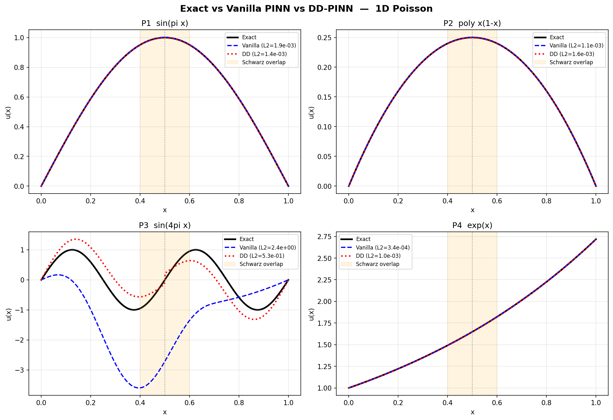
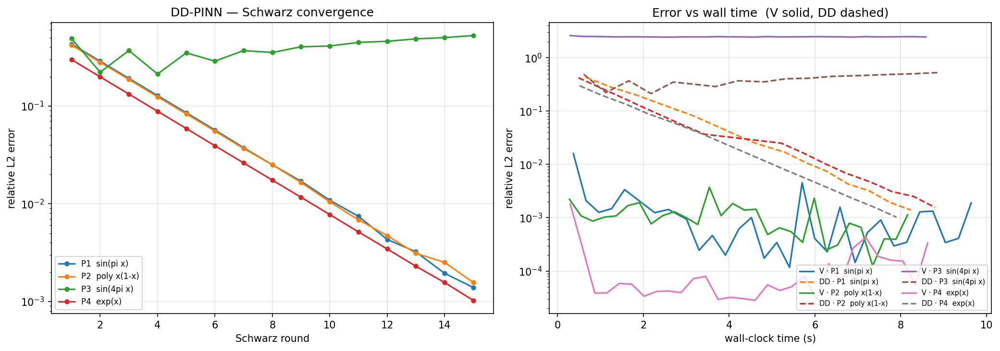
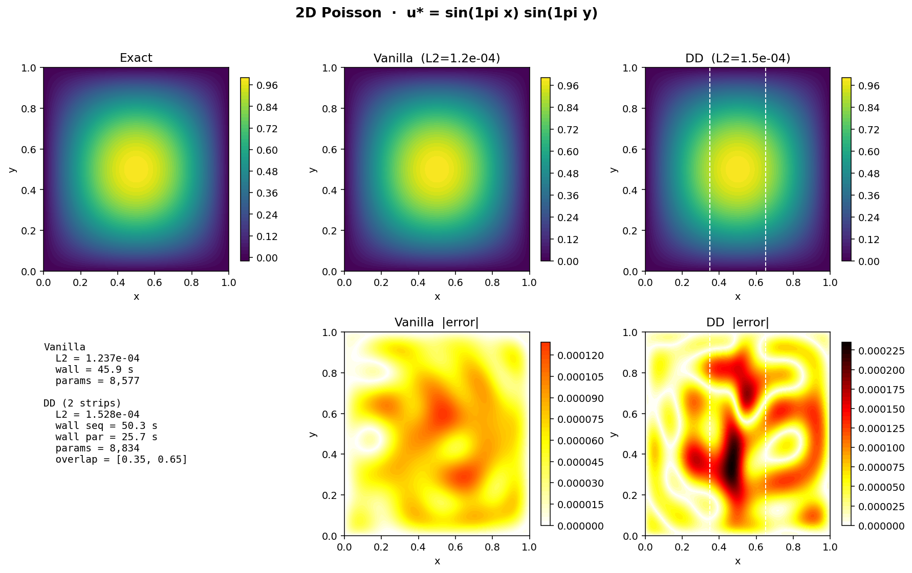
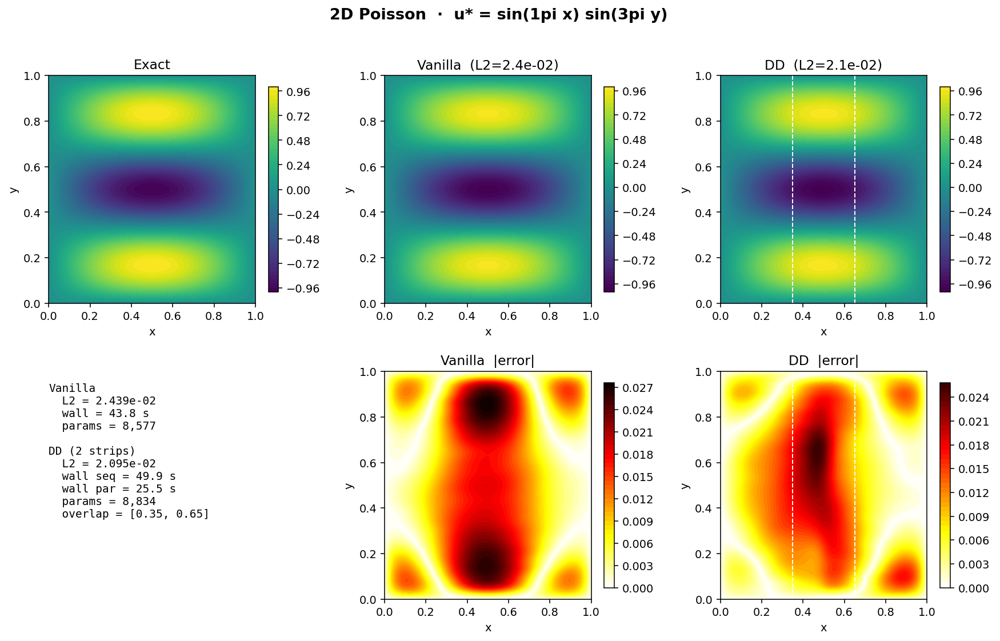
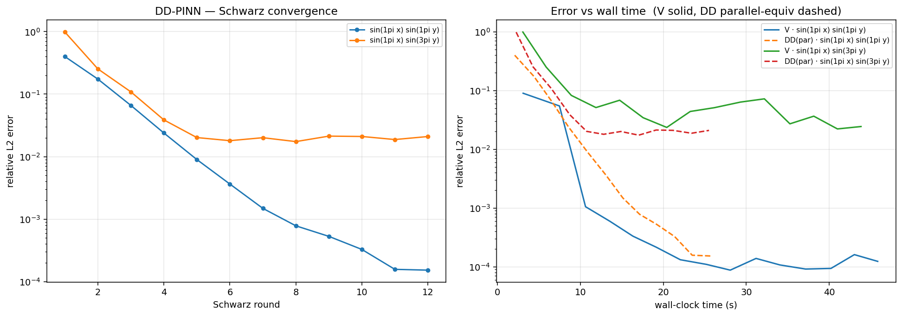

# Domain Decomposition Accelerated Neural Networks (DD-ANNs)
### Summer Research Internship Program (SRIP) 2026 — IIT Gandhinagar

**Student:** Krishna (VIT Vellore) , Chitiveli Hemcharan Varma (IIT Gandhinagar)

**Supervisor:** Dr. Abhinav Jha

**Institute:** Indian Institute of Technology Gandhinagar  

---

## Project Overview

This project explores Physics-Informed Neural Networks (PINNs) as 
mesh-free solvers for partial differential equations (PDEs), with 
the goal of combining them with classical domain decomposition 
techniques to build scalable DD-ANN frameworks.

The ultimate application is solving electrostatic models used in 
computational chemistry — specifically the Linearized 
Poisson–Boltzmann (LPB) equation and the COSMO model — which 
arise in biomolecular simulation and solvation energy calculations.

---

## Repository Structure

```
Phase1_PINN_1D/
  pinn_1D_vs_dd.ipynb     # Vanilla PINN vs DD-PINN on 1D Poisson + comparison table
  archive/                # earlier exploratory notebooks
Phase2_PINN_2D/
  pinn_2D_vs_dd.ipynb     # Vanilla PINN vs DD-PINN on 2D Poisson + comparison table
  archive/
Phase3_PINN_3D/
  pinn_3d_LPB.ipynb       # 3D PINN toward the Linearized Poisson–Boltzmann model
References/               # Key reference papers
README.md
```

Each Phase-1/2 notebook is **self-contained and fully executed**: it implements
both methods from scratch, runs them under a matched capacity/budget, and prints
the real measured results (no cached or hand-edited numbers).

---

## Methods compared

- **Vanilla PINN** — one global network over the whole domain.
- **DD-PINN** — split the domain into two **overlapping** subdomains, a smaller
  hard-BC PINN on each, coupled by an **overlapping Schwarz** outer iteration that
  exchanges Dirichlet data on the interface line each round (converges
  geometrically; faster with larger overlap).

Both enforce boundary conditions **exactly** with a distance function
($u=\text{lift}+\text{(distance)}\cdot N_\theta$), so the loss is the pure PDE
residual — no boundary penalty to balance.

---

## Results (real, reproduced in the notebooks)

All numbers below are measured by the notebooks themselves on CPU, under matched
network capacity and a matched optimization budget. For DD we report **two**
training times: *sequential* (both subdomains on one machine) and
*parallel-equivalent* (the subdomains are independent, so the per-round cost is
the slower of the two). We also report **prediction (inference) time** — the
cost of one forward pass over the evaluation grid.

### 1D Poisson  $-u''=f$ on $[0,1]$

One width-47 network vs. two width-32 networks (≈4.7k vs ≈4.4k params), 6000
optimization steps each.

| Problem | Vanilla L2 | DD L2 | Vanilla train | DD train (seq / par) | Vanilla predict | DD predict |
|---|---|---|---|---|---|---|
| $\sin(\pi x)$ | 1.9e-03 | 1.4e-03 | 9.6 s | 15.9 / 8.2 s | 0.21 ms | 0.36 ms |
| $x(1-x)$ | 1.1e-03 | 1.6e-03 | 8.2 s | 16.2 / 8.8 s | 0.20 ms | 0.37 ms |
| $\sin(4\pi x)$ *(high-freq)* | **2.4e+00** | **5.3e-01** | 8.6 s | 17.0 / 8.9 s | 0.21 ms | 0.37 ms |
| $e^{x}$ | 3.4e-04 | 1.0e-03 | 8.6 s | 15.5 / 7.9 s | 0.21 ms | 0.37 ms |

DD matches the global PINN on the smooth problems and is **~5× more accurate on
the high-frequency case**, where a global PINN is crippled by spectral bias (each
subdomain sees a lower effective frequency). Parallel-equivalent training time is
on par with the global PINN.




### 2D Poisson  $-\Delta u=f$ on $[0,1]^2$

One `2-64-64-64-1` network vs. two `2-64-64-1` strips (≈8.6k vs ≈8.8k params),
4500 steps (vanilla) vs. 12 Schwarz rounds × 400 steps (DD).

| Problem | Vanilla L2 | DD L2 | Vanilla train | DD train (seq / par) | Par speed-up | Vanilla predict | DD predict |
|---|---|---|---|---|---|---|---|
| $\sin(\pi x)\sin(\pi y)$ | 1.2e-04 | 1.5e-04 | 45.9 s | 50.3 / 25.7 s | **1.78×** | 8.9 ms | 10.3 ms |
| $\sin(\pi x)\sin(3\pi y)$ | 2.4e-02 | 2.1e-02 | 43.8 s | 49.9 / 25.5 s | **1.72×** | 8.9 ms | 10.3 ms |

DD reproduces the global PINN's accuracy while each strip is half the domain and
independent, so the **parallel-equivalent** training time is ~1.7–1.8× lower.





### Efficiency: where DD wins and where it doesn't

- **Training** is where DD pays off: at matched accuracy, the parallel-equivalent
  training time is ~1.7–1.8× lower in 2D (each subdomain is a smaller, independent
  problem). On a *single* machine the sequential time is higher — the win needs
  parallel hardware.
- **Prediction** slightly *favors the vanilla PINN*: DD evaluates two networks plus
  a blend, so inference is marginally slower (≈0.2→0.4 ms in 1D, ≈9→10 ms in 2D).
  Inference cost is negligible next to training either way.
- **Honest limit of two subdomains:** because we decompose only in $x$, two strips
  help when the difficulty is in $y$ but **not** when the solution oscillates
  rapidly in $x$ itself (a $\sin(3\pi x)$ test left 2-strip DD an order of
  magnitude behind the global PINN). Resolving that needs **more subdomains** — the
  natural next step toward the LPB / COSMO target.

---

## Progress

| Phase | Task | Status |
|-------|------|--------|
| Phase 1 | PINN vs DD-PINN on 1D PDEs (comparison) | ✅ Complete |
| Phase 2 | PINN vs DD-PINN on 2D PDEs (comparison) | ✅ Complete |
| Phase 3 | 3D PINN / Linearized Poisson–Boltzmann | 🔄 In Progress |
| Next | DD with >2 subdomains; application to LPB / COSMO | ⏳ Upcoming |

---

## Key Concepts Implemented

- PDE residual minimization via automatic differentiation
- Exact (hard) boundary conditions via distance functions — pure residual loss
- Overlapping Schwarz domain decomposition with interface Dirichlet transmission
- Geometric Schwarz convergence; capacity- and budget-matched benchmarking
- Profiling of training time, parallel-equivalent time, and inference time

---

## Tech Stack

Python · PyTorch · NumPy · Matplotlib · Jupyter Notebook

---

## References

1. Raissi, Perdikaris, Karniadakis — *Physics-Informed Neural Networks* (2019)
2. Wang, Sankaran, Wang, Perdikaris — *An Expert's Guide to Training PINNs* (2023)
