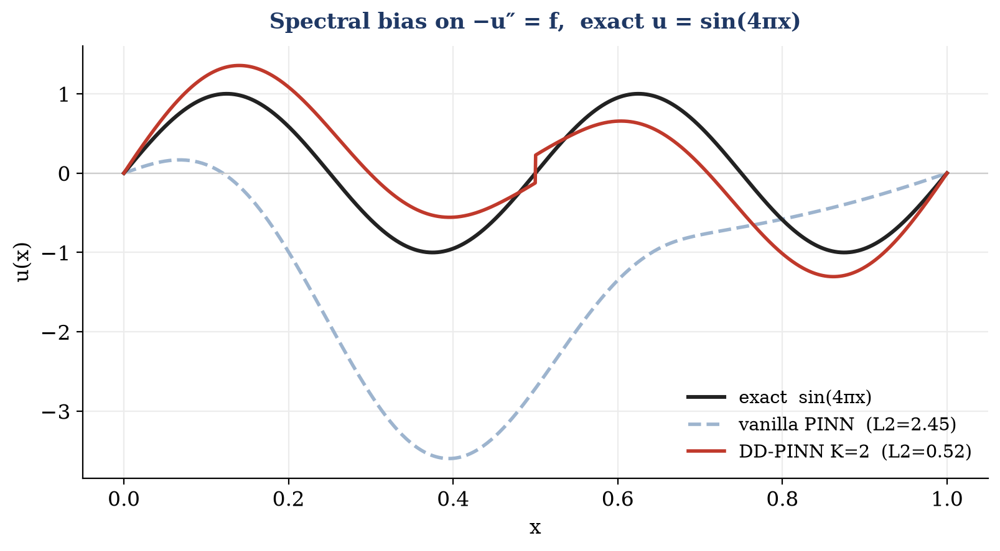

# DD-ANN — Domain Decomposition Accelerated Neural Networks

Scalable, parallel, mesh-free PDE solvers combining **Physics-Informed Neural Networks (PINNs)** with classical **overlapping Schwarz domain decomposition** — built toward the electrostatic models of computational chemistry (Linearized Poisson–Boltzmann, COSMO).

**SRIP 2026 · IIT Gandhinagar**  
Students: Chitiveli Hemcharan Varma (IITGN) · Krishna (VIT Vellore)  
Supervisor: Dr. Abhinav Jha

---

## Why domain decomposition?

A vanilla PINN solves a PDE by minimizing the equation's residual over a set of collocation points — no mesh required. Two problems arise at scale:

- **Spectral bias** — networks learn high-frequency content slowly, so accuracy degrades on oscillatory solutions.
- **Cost** — a single large network over a large domain is expensive to train.

Domain decomposition addresses both. The domain is split into **overlapping subdomains**; a small PINN trains on each and the subdomains are coupled via a **Jacobi-style overlapping Schwarz iteration** that exchanges interface values between neighbours each round.

Because each subdomain is a smaller, lower-frequency, *independent* problem:
- spectral bias is mitigated — each network sees a lower effective frequency
- subdomains train **concurrently** on separate cores or nodes

---

## How it works

### The PDEs

**1D Poisson** on $[0,1]$:

$$-u''(x) = f(x), \quad u(0) = u(1) = 0$$

**2D Poisson** on $[0,1]^2$:

$$-\Delta u(x,y) = f(x,y), \quad u\big|_{\partial\Omega} = 0$$

The forcing $f$ is chosen so the exact solution $u$ is known analytically. Error is measured as the relative $L_2$ error:

$$\varepsilon = \frac{\|u_\theta - u\|_2}{\|u\|_2}$$

### Boundary conditions — hard enforcement

Boundary conditions are imposed **exactly** through a distance-function ansatz:

$$u_\theta(x) = \text{lift}(x) + d(x)\, N_\theta(x)$$

where `lift` interpolates the boundary data and $d$ vanishes on $\partial\Omega$ by construction:

- **1D:** $d(x) = (x - a)(x - b)$
- **2D (unit square):** $d(x, y) = x(1-x)\, y(1-y)$

Because $d = 0$ on the boundary, BCs hold for any $N_\theta$. The training loss is the **pure PDE residual** — no boundary-penalty term to tune.

### Overlapping Schwarz iteration

Each Schwarz round: every subdomain trains for a fixed number of steps against its neighbours' *previous-round* interface values, then publishes updated values. All subdomains use last round's data, so they are fully independent within a round — and therefore parallelisable.

### Interface transmission

| Phase | How interface values are passed |
|---|---|
| **1D** | **Hard injection** — neighbour's interior value enters the subdomain's lift term; interface condition holds by construction each round. |
| **2D** | **Soft penalty** — each strip adds $w\,\lVert N_\theta(\text{interface}) - \text{neighbour profile}\rVert^2$ with $w = 300$ that pulls its solution toward the neighbour's frozen profile along the shared line $x = \text{const}$. |

Outer-box Dirichlet conditions are always enforced exactly via the distance-function ansatz; only internal interfaces differ.

### Why overlap is essential

With hard BCs, a subdomain evaluated *at its own boundary* returns the imposed value by construction. If subdomains merely **touched**, the transmitted value would be self-referential and could never update — the classical ill-posedness of non-overlapping Dirichlet–Dirichlet coupling. **Overlap** lets each subdomain read a genuine PDE value from the neighbour's interior, and the Schwarz iteration converges geometrically.

---

## Problem set

**1D** — $-u'' = f$ on $[0,1]$:

| ID | Exact solution $u(x)$ | Character |
|---|---|---|
| `sin1` | $\sin(\pi x)$ | smooth |
| `sin4` | $\sin(4\pi x)$ | high-frequency (spectral-bias stress test) |
| `exp` | $e^x$ | non-zero boundary data |

**2D** — $-\Delta u = f$ on $[0,1]^2$, decomposed into vertical strips overlapping in $x$:

| ID | Exact solution $u(x,y)$ | Character |
|---|---|---|
| `sin11` | $\sin(\pi x)\sin(\pi y)$ | smooth |
| `sin13` | $\sin(\pi x)\sin(3\pi y)$ | anisotropic — fast in $y$ |
| `sin31` | $\sin(3\pi x)\sin(\pi y)$ | anisotropic — fast in $x$ |
| `sin33` | $\sin(3\pi x)\sin(3\pi y)$ | high-frequency both axes |

Helmholtz cases (`k1`, `k4`, `k9`) are also included in the full 2D sweep.

---

## Repository structure

```
DD-ANN/
├── Phase1_PINN_1D/
│   ├── dd_parallel_mp.py        # vanilla PINN, DD-PINN, true-parallel DD (1D)
│   └── run_all_1d.py            # sweep all 1D problems across all methods
├── Phase2_PINN_2D/
│   ├── dd_parallel_mp_2d.py     # vanilla PINN, DD-PINN (strips), true-parallel DD (2D)
│   └── run_all_problems.py      # sweep all 2D problems across all methods
├── figure1_spectral_bias.png    # spectral bias accuracy comparison
├── figure2_speedup.png          # wall-clock speed-up bar chart
├── make_figures.py              # script to regenerate figures
├── References/                  # key reference papers
└── README.md
```

Each script is **self-contained** — implements vanilla PINN, decomposed PINN, single-process baseline, and true-parallel solver, then prints measured results under matched network capacity and optimization budget. No numbers are cached or hand-edited.

---

## Results

All measurements on **Apple M3** (4 performance + 4 efficiency cores), Python 3.13, PyTorch 2.9, **CPU** — for networks this small, CPU outperforms the GPU/MPS backend where kernel-launch overhead dominates.

Network capacity is matched across methods: in 1D a width-47 global network (~4.7k params) vs. two width-32 subdomain networks (~4.4k total); in 2D a `2-64-64-64-1` global network (~8.6k) vs. two `2-64-64-1` strips (~8.8k total).

---

### Phase 1 — 1D Poisson

**Table 1.** *1D accuracy (relative $L_2$ error).* 6000 steps; DD: 15 Schwarz rounds × 400 steps.

| Problem | Vanilla PINN | DD-PINN ($K=2$) |
|---|---:|---:|
| $\sin(\pi x)$ (smooth) | 1.89e-03 | 1.46e-03 |
| **$\sin(4\pi x)$ (high-freq)** | **2.45e+00** | **5.22e-01** |
| $e^x$ (non-zero BC) | 3.36e-04 | 1.06e-03 |

On `sin4`, decomposition is **~5× more accurate** — the global PINN is crippled by spectral bias while each subdomain sees a lower effective frequency. **In 1D, the value of decomposition is accuracy.**



**Table 2.** *1D vanilla PINN vs. true-parallel DD (capacity-matched).*

| Problem | Vanilla $L_2$ | DD $L_2$ | Vanilla (s) | DD (s) | DD vs. vanilla |
|---|---:|---:|---:|---:|---:|
| $\sin(\pi x)$ | 1.89e-03 | 1.46e-03 | 9.67 | 9.85 | 0.98× |
| $\sin(4\pi x)$ | 2.45e+00 | 5.22e-01 | 8.52 | 9.09 | 0.94× |
| $e^x$ | 3.36e-04 | 1.06e-03 | 8.37 | 9.04 | 0.93× |

1D subdomains are too small for a wall-clock win — DD wins on **accuracy** instead.

**Table 6.** *1D wall-clock vs. network depth on $\sin(4\pi x)$, matched 6000-step budget.* The DD-vs-vanilla ratio rises monotonically and crosses parity as per-subdomain workload grows.

| Network depth | Vanilla params | DD params ($K=2$) | DD vs. vanilla |
|---|---:|---:|---:|
| 3 *(reported above)* | 4,654 | 4,418 | 0.94× |
| 5 | 9,166 | 8,642 | 0.99× |
| 8 | 15,934 | 14,978 | **1.06×** |

---

### Phase 2 — 2D Poisson

**Table 3.** *2D accuracy (relative $L_2$ error).* Vanilla: 4500 steps; DD: 12 Schwarz rounds × 400 steps.

| Problem | Vanilla PINN | DD-PINN ($K=2$) |
|---|---:|---:|
| $\sin(\pi x)\sin(\pi y)$ (smooth) | 1.24e-04 | 4.96e-03 |
| $\sin(\pi x)\sin(3\pi y)$ (anisotropic) | 2.44e-02 | 1.57e-02 |

**Table 4.** *Full 2D sweep — vanilla vs. sequential vs. true-parallel DD ($K=2$, identical hyper-parameters).*

| Problem | $L_2$ van | $L_2$ DD | van (s) | seq (s) | par (s) | DD/seq | DD/van |
|---|---:|---:|---:|---:|---:|---:|---:|
| Poisson sin11 | 1.24e-04 | 4.96e-03 | 42.48 | 45.38 | 29.65 | 1.53× | **1.43×** |
| Poisson sin13 | 2.44e-02 | 1.57e-02 | 49.06 | 44.66 | 27.49 | 1.62× | **1.78×** |
| Poisson sin31 | 1.20e-02 | 2.33e-01 | 43.92 | 44.90 | 27.84 | 1.61× | **1.58×** |
| Poisson sin33 | 1.71e-01 | 1.85e-01 | 44.67 | 45.65 | 31.34 | 1.46× | **1.43×** |
| Helmholtz k1  | 2.00e+00 | 2.00e+00 | 45.26 | 44.65 | 29.19 | 1.53× | **1.55×** |
| Helmholtz k4  | 2.00e+00 | 2.00e+00 | 44.85 | 44.03 | 27.03 | 1.63× | **1.66×** |
| Helmholtz k9  | 2.40e+00 | 2.05e+00 | 43.88 | 45.71 | 27.51 | 1.66× | **1.60×** |

True-parallel DD is **consistently 1.43–1.78× faster** than the global PINN across all 7 cases. The speed-up is a property of the parallelism, not any particular solution.

**Table 5.** *Parallel vs. sequential DD (genuine concurrency).*

$$\text{speed-up} = \frac{\text{sequential DD (one process)}}{\text{true-parallel DD (two processes)}}$$

| Problem | DD $L_2$ | Sequential (s) | Parallel (s) | Speed-up |
|---|---:|---:|---:|---:|
| 1D $\sin(4\pi x)$ | 5.22e-01 | 15.62 | 9.63 | **1.62×** |
| 2D $\sin(\pi x)\sin(3\pi y)$ | 1.57e-02 | 44.66 | 27.49 | **1.62×** |


---

### Discussion

**Decomposition direction matters.** Strips split the domain in $x$, so the soft interface coupling fares best when fast variation runs *along* the interfaces (in $y$). On `sin13` — fast in $y$, parallel to cuts — DD is more accurate than the global PINN. On `sin31` — fast in $x$, cutting across strips — accuracy degrades sharply. Fixes: align the cut with the low-frequency axis, or decompose in both directions. Speed is unaffected either way.

**Why 1D is overhead-bound.** The per-subdomain work in 1D is too small to cover the fixed cost of decomposition (process spawn, one interface exchange per round, single-thread pin). This cost is essentially constant, so the ratio improves as the network grows — exactly what Table 6 shows. In 2D each strip carries a larger workload, which is why DD comfortably clears parity (1.43–1.78×).

**Performance-core constraint.** The Schwarz round is a synchronization barrier — each round waits for the slowest subdomain. The clean ~1.5× speed-up at $K=2$ requires both subdomains to land on performance cores. More subdomains than performance cores would push workers onto efficiency cores and stall the barrier; this is why $K=2$ is used here. The intended deployment is homogeneous multi-node HPC, where every subdomain gets an equal core or node.

---

## Implementation notes — true parallelism on macOS

| Issue | Fix |
|---|---|
| Python GIL serializes threads | Use `torch.multiprocessing` — one OS process per subdomain |
| macOS `spawn` re-imports the target | Worker lives at **module scope** in a `.py` file — not a notebook |
| BLAS pools fight over cores | Each worker pins `torch.set_num_threads(1)` |
| IPC overhead | Persistent workers — model built once; only interface values cross the pipe per Schwarz round |

**Scripts must be run from the command line, not from a Jupyter notebook.**

---

## Reproducing results

Requirements: **Python 3.13**, **PyTorch >= 2.9**, **NumPy**

```bash
# 1D — sequential vs. parallel speed-up
python3.13 Phase1_PINN_1D/dd_parallel_mp.py    --prob sin4  --Ks 2

# 1D — vanilla vs. true-parallel DD head-to-head
python3.13 Phase1_PINN_1D/dd_parallel_mp.py    --prob sin4  --vs-vanilla

# 2D — sequential vs. parallel speed-up
python3.13 Phase2_PINN_2D/dd_parallel_mp_2d.py --prob sin13 --Ks 2

# 2D — vanilla vs. true-parallel DD head-to-head
python3.13 Phase2_PINN_2D/dd_parallel_mp_2d.py --prob sin13 --vs-vanilla

# full sweeps (all problems, all methods)
python3.13 Phase1_PINN_1D/run_all_1d.py        --Ks 2
python3.13 Phase2_PINN_2D/run_all_problems.py  --Ks 2

# regenerate figures
python3.13 make_figures.py
```

Absolute timings vary by machine; qualitative conclusions hold.

---

## Roadmap

| Phase | Scope | Status |
|---|---|---|
| Phase 1 | Vanilla PINN vs. DD-PINN, 1D Poisson + true-parallel benchmark | Complete |
| Phase 2 | Vanilla PINN vs. DD-PINN, 2D Poisson + true-parallel benchmark | Complete |
| Next | Additive/asynchronous Schwarz · multi-node cluster scaling · 3D PINN · Linearized Poisson-Boltzmann / COSMO | Planned |

---

## Tech stack

Python · PyTorch · NumPy · `torch.multiprocessing`

---

## References

1. Raissi, Perdikaris, Karniadakis. *Physics-Informed Neural Networks: A Deep Learning Framework for Solving Forward and Inverse Problems Involving Nonlinear PDEs.* Journal of Computational Physics, 2019.
2. Wang, Sankaran, Wang, Perdikaris. *An Expert's Guide to Training Physics-Informed Neural Networks.* 2023.