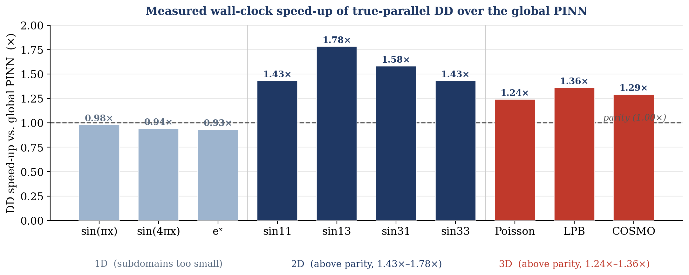
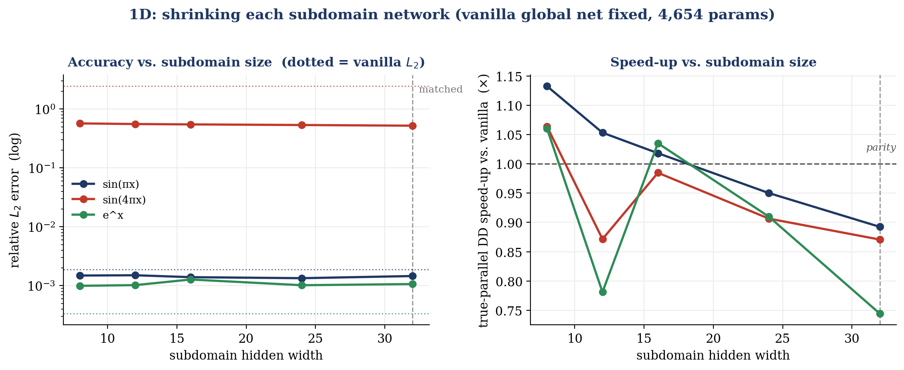
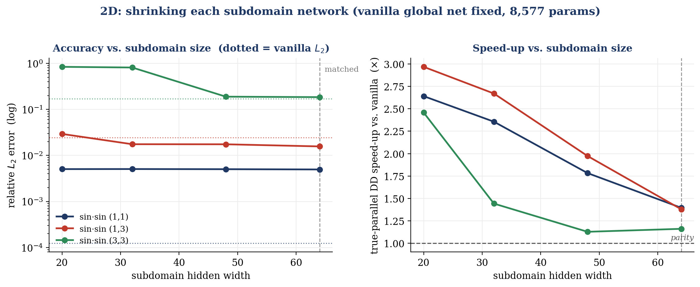
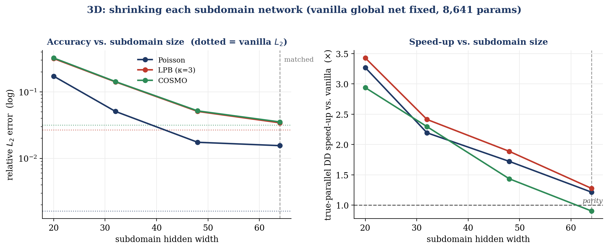
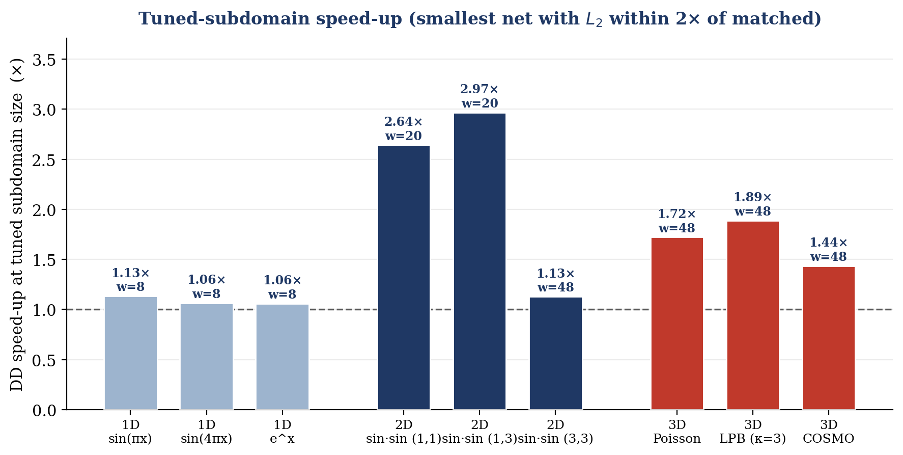

# DD-ANN — Domain Decomposition Accelerated Neural Networks

Scalable, parallel, mesh-free PDE solvers combining **Physics-Informed Neural Networks (PINNs)** with classical **overlapping Schwarz domain decomposition** — built toward the electrostatic models of computational chemistry (Linearized Poisson–Boltzmann, COSMO).

**SRIP 2026 · IIT Gandhinagar**  
Students: Chitiveli Hemcharan Varma (IITGN) · Krishna (VIT Vellore)  
Supervisor: Dr. Abhinav Jha

---

## Why domain decomposition?

A vanilla PINN solves a PDE by minimizing the equation's residual over a set of collocation points — no mesh required. Two problems arise at scale:

- **Spectral bias** — networks learn high-frequency content slowly, so accuracy degrades on oscillatory solutions.
- **Cost** — a single large network over a large domain is expensive to train.

Domain decomposition addresses both. The domain is split into **overlapping subdomains**; a small PINN trains on each and the subdomains are coupled via a **Jacobi-style overlapping Schwarz iteration** that exchanges interface values between neighbours each round.

Because each subdomain is a smaller, lower-frequency, *independent* problem:
- spectral bias is mitigated — each network sees a lower effective frequency
- subdomains train **concurrently** on separate cores or nodes

---

## How it works

### The PDEs

**1D Poisson** on $[0,1]$:

$$-u''(x) = f(x), \quad u(0) = u(1) = 0$$

**2D Poisson** on $[0,1]^2$:

$$-\Delta u(x,y) = f(x,y), \quad u\big|_{\partial\Omega} = 0$$

**3D electrostatics** on $[0,1]^3$ — three operators from continuum solvation chemistry, all in coercive elliptic form with $u\big|_{\partial\Omega} = 0$:

$$\text{Poisson:}\quad -\Delta u = f \qquad\qquad\quad\;\; \text{(uniform dielectric)}$$

$$\text{LPB:}\quad -\Delta u + \kappa^2 u = f \qquad\quad\; \text{(Debye screening, } \kappa = \text{inverse Debye length)}$$

$$\text{COSMO:}\quad -\nabla\!\cdot\!\big(\varepsilon(\mathbf r)\,\nabla u\big) = f \quad \text{(spatially varying dielectric } \varepsilon)$$

The **Linearized Poisson–Boltzmann** operator is the screened Poisson equation governing electrostatics in an ionic solution; the **COSMO / polarizable-continuum** operator is the variable-dielectric Poisson equation across a solute→solvent dielectric interface. Here $\varepsilon(\mathbf r) = 1 + a_x x + a_y y + a_z z$ is affine, so $\nabla\varepsilon$ is constant and the forcing stays fully analytic.

The forcing $f$ is chosen so the exact solution $u$ is known analytically. Error is measured as the relative $L_2$ error:

$$\varepsilon = \frac{\|u_\theta - u\|_2}{\|u\|_2}$$

### Boundary conditions — hard enforcement

Boundary conditions are imposed **exactly** through a distance-function ansatz:

$$u_\theta(x) = \text{lift}(x) + d(x)\, N_\theta(x)$$

where `lift` interpolates the boundary data and $d$ vanishes on $\partial\Omega$ by construction:

- **1D:** $d(x) = (x - a)(x - b)$
- **2D (unit square):** $d(x, y) = x(1-x)\, y(1-y)$
- **3D (unit cube):** $d(x, y, z) = x(1-x)\, y(1-y)\, z(1-z)$

Because $d = 0$ on the boundary, BCs hold for any $N_\theta$. The training loss is the **pure PDE residual** — no boundary-penalty term to tune.

### Overlapping Schwarz iteration

Each Schwarz round: every subdomain trains for a fixed number of steps against its neighbours' *previous-round* interface values, then publishes updated values. All subdomains use last round's data, so they are fully independent within a round — and therefore parallelisable.

### Interface transmission

| Phase | How interface values are passed |
|---|---|
| **1D** | **Hard injection** — neighbour's interior value enters the subdomain's lift term; interface condition holds by construction each round. |
| **2D** | **Soft penalty** — each strip adds $w\,\lVert N_\theta(\text{interface}) - \text{neighbour profile}\rVert^2$ with $w = 300$ that pulls its solution toward the neighbour's frozen profile along the shared line $x = \text{const}$. |
| **3D** | **Soft penalty** — identical mechanism, but the interface is now a **plane** $x = \text{const}$ sampled on a $16\times16$ grid over $(y, z)$; each slab matches its neighbour's frozen profile on that plane. |

Outer-box Dirichlet conditions are always enforced exactly via the distance-function ansatz; only internal interfaces differ.

### Why overlap is essential

With hard BCs, a subdomain evaluated *at its own boundary* returns the imposed value by construction. If subdomains merely **touched**, the transmitted value would be self-referential and could never update — the classical ill-posedness of non-overlapping Dirichlet–Dirichlet coupling. **Overlap** lets each subdomain read a genuine PDE value from the neighbour's interior, and the Schwarz iteration converges geometrically.

---

## Problem set

**1D** — $-u'' = f$ on $[0,1]$:

| ID | Exact solution $u(x)$ | Character |
|---|---|---|
| `sin1` | $\sin(\pi x)$ | smooth |
| `sin4` | $\sin(4\pi x)$ | high-frequency (spectral-bias stress test) |
| `exp` | $e^x$ | non-zero boundary data |

**2D** — $-\Delta u = f$ on $[0,1]^2$, decomposed into vertical strips overlapping in $x$:

| ID | Exact solution $u(x,y)$ | Character |
|---|---|---|
| `sin11` | $\sin(\pi x)\sin(\pi y)$ | smooth |
| `sin13` | $\sin(\pi x)\sin(3\pi y)$ | anisotropic — fast in $y$ |
| `sin31` | $\sin(3\pi x)\sin(\pi y)$ | anisotropic — fast in $x$ |
| `sin33` | $\sin(3\pi x)\sin(3\pi y)$ | high-frequency both axes |

Helmholtz cases (`k1`, `k4`, `k9`) are also included in the full 2D sweep.

**3D** — three electrostatics operators on $[0,1]^3$, decomposed into slabs overlapping in $x$; interfaces are planes in $(y,z)$. Exact solution is $u = \sin(k_x\pi x)\sin(k_y\pi y)\sin(k_z\pi z)$ throughout.

| Family | ID | Operator | Character |
|---|---|---|---|
| **Poisson** | `pois_111` | $-\Delta u = f$ | smooth (representative) |
| | `pois_112`, `pois_222` | | anisotropic / high-freq |
| **LPB** | `lpb_k3` | $-\Delta u + \kappa^2 u = f$ | moderate Debye screening $\kappa=3$ (representative) |
| | `lpb_k1`, `lpb_k8` | | weak / strong screening |
| **COSMO** | `cosmo_mid` | $-\nabla\!\cdot\!(\varepsilon\nabla u) = f$ | moderate dielectric contrast (representative) |
| | `cosmo_lo`, `cosmo_hi` | | gentle / strong $\varepsilon$-gradient |

---

## Repository structure

```
DD-ANN/
├── Phase1_PINN_1D/
│   ├── dd_parallel_mp.py        # vanilla PINN, DD-PINN, true-parallel DD (1D)
│   └── run_all_1d.py            # sweep all 1D problems across all methods
├── Phase2_PINN_2D/
│   ├── dd_parallel_mp_2d.py     # vanilla PINN, DD-PINN (strips), true-parallel DD (2D)
│   └── run_all_problems.py      # sweep all 2D problems across all methods
├── Phase3_PINN_3D/
│   ├── dd_parallel_mp_3d.py     # vanilla PINN, DD-PINN (slabs), true-parallel DD — Poisson/LPB/COSMO (3D)
│   └── run_all_3d.py            # sweep all 3D problems across all methods
├── studies/                     # supplementary subdomain-size study (all dims)
│   ├── slab_size_study.py           # subdomain-size sweep + figures 3–4
│   ├── slab_size_results.json       # measured sweep data (regenerated by the study)
│   ├── figure3_slabsize_{1d,2d,3d}.png  # subdomain-size vs. accuracy/speed-up sweeps
│   └── figure4_slabsize_summary.png     # tuned-subdomain speed-up across dimensions
├── figure1_spectral_bias.png    # spectral bias accuracy comparison
├── figure2_speedup.png          # wall-clock speed-up bar chart
├── make_figures.py              # regenerate figures 1–2
├── References/                  # key reference papers
└── README.md
```

Each script is **self-contained** — implements vanilla PINN, decomposed PINN, single-process baseline, and true-parallel solver, then prints measured results under matched network capacity and optimization budget. No numbers are cached or hand-edited.

---

## Results

All measurements on **Apple M3** (4 performance + 4 efficiency cores), Python 3.13, PyTorch 2.9, **CPU** — for networks this small, CPU outperforms the GPU/MPS backend where kernel-launch overhead dominates.

Network capacity is matched across methods: in 1D a width-47 global network (~4.7k params) vs. two width-32 subdomain networks (~4.4k total); in 2D a `2-64-64-64-1` global network (~8.6k) vs. two `2-64-64-1` strips (~8.8k total).

---

### Phase 1 — 1D Poisson

**Table 1.** *1D accuracy (relative $L_2$ error).* 6000 steps; DD: 15 Schwarz rounds × 400 steps.

| Problem | Vanilla PINN | DD-PINN ($K=2$) |
|---|---:|---:|
| $\sin(\pi x)$ (smooth) | 1.89e-03 | 1.46e-03 |
| **$\sin(4\pi x)$ (high-freq)** | **2.45e+00** | **5.22e-01** |
| $e^x$ (non-zero BC) | 3.36e-04 | 1.06e-03 |

On `sin4`, decomposition is **~5× more accurate** — the global PINN is crippled by spectral bias while each subdomain sees a lower effective frequency. **In 1D, the value of decomposition is accuracy.**


**Table 2.** *1D vanilla PINN vs. true-parallel DD (capacity-matched).*

| Problem | Vanilla $L_2$ | DD $L_2$ | Vanilla (s) | DD (s) | DD vs. vanilla |
|---|---:|---:|---:|---:|---:|
| $\sin(\pi x)$ | 1.89e-03 | 1.46e-03 | 9.67 | 9.85 | 0.98× |
| $\sin(4\pi x)$ | 2.45e+00 | 5.22e-01 | 8.52 | 9.09 | 0.94× |
| $e^x$ | 3.36e-04 | 1.06e-03 | 8.37 | 9.04 | 0.93× |

1D subdomains are too small for a wall-clock win — DD wins on **accuracy** instead.

**Table 6.** *1D wall-clock vs. network depth on $\sin(4\pi x)$, matched 6000-step budget.* The DD-vs-vanilla ratio rises monotonically and crosses parity as per-subdomain workload grows.

| Network depth | Vanilla params | DD params ($K=2$) | DD vs. vanilla |
|---|---:|---:|---:|
| 3 *(reported above)* | 4,654 | 4,418 | 0.94× |
| 5 | 9,166 | 8,642 | 0.99× |
| 8 | 15,934 | 14,978 | **1.06×** |

---

### Phase 2 — 2D Poisson

**Table 3.** *2D accuracy (relative $L_2$ error).* Vanilla: 4500 steps; DD: 12 Schwarz rounds × 400 steps.

| Problem | Vanilla PINN | DD-PINN ($K=2$) |
|---|---:|---:|
| $\sin(\pi x)\sin(\pi y)$ (smooth) | 1.24e-04 | 4.96e-03 |
| $\sin(\pi x)\sin(3\pi y)$ (anisotropic) | 2.44e-02 | 1.57e-02 |

**Table 4.** *Full 2D sweep — vanilla vs. sequential vs. true-parallel DD ($K=2$, identical hyper-parameters).*

| Problem | $L_2$ van | $L_2$ DD | van (s) | seq (s) | par (s) | DD/seq | DD/van |
|---|---:|---:|---:|---:|---:|---:|---:|
| Poisson sin11 | 1.24e-04 | 4.96e-03 | 42.48 | 45.38 | 29.65 | 1.53× | **1.43×** |
| Poisson sin13 | 2.44e-02 | 1.57e-02 | 49.06 | 44.66 | 27.49 | 1.62× | **1.78×** |
| Poisson sin31 | 1.20e-02 | 2.33e-01 | 43.92 | 44.90 | 27.84 | 1.61× | **1.58×** |
| Poisson sin33 | 1.71e-01 | 1.85e-01 | 44.67 | 45.65 | 31.34 | 1.46× | **1.43×** |
| Helmholtz k1  | 2.00e+00 | 2.00e+00 | 45.26 | 44.65 | 29.19 | 1.53× | **1.55×** |
| Helmholtz k4  | 2.00e+00 | 2.00e+00 | 44.85 | 44.03 | 27.03 | 1.63× | **1.66×** |
| Helmholtz k9  | 2.40e+00 | 2.05e+00 | 43.88 | 45.71 | 27.51 | 1.66× | **1.60×** |

True-parallel DD is **consistently 1.43–1.78× faster** than the global PINN across all 7 cases. The speed-up is a property of the parallelism, not any particular solution.

**Table 5.** *Parallel vs. sequential DD (genuine concurrency).*

$$\text{speed-up} = \frac{\text{sequential DD (one process)}}{\text{true-parallel DD (two processes)}}$$

| Problem | DD $L_2$ | Sequential (s) | Parallel (s) | Speed-up |
|---|---:|---:|---:|---:|
| 1D $\sin(4\pi x)$ | 5.22e-01 | 15.62 | 9.63 | **1.62×** |
| 2D $\sin(\pi x)\sin(3\pi y)$ | 1.57e-02 | 44.66 | 27.49 | **1.62×** |
| 3D Poisson | 1.55e-02 | 59.53 | 43.18 | **1.38×** |



---

### Phase 3 — 3D electrostatics (Poisson · LPB · COSMO)

Three operators from continuum solvation chemistry, decomposed into two slabs overlapping in $x$ with plane interfaces in $(y,z)$. Capacity is matched exactly as in 2D — a global `3-64-64-64-1` network (~8.6k params) vs. two `3-64-64-1` slabs (~9.0k total). Vanilla: 3000 steps; DD: 10 Schwarz rounds × 300 steps.

**Table 7.** *3D vanilla PINN vs. sequential vs. true-parallel DD ($K=2$, identical hyper-parameters).*

| Problem | Operator | $L_2$ van | $L_2$ DD | van (s) | seq (s) | par (s) | DD/seq | DD/van |
|---|---|---:|---:|---:|---:|---:|---:|---:|
| `pois_111` | $-\Delta u = f$ | 1.61e-03 | 1.55e-02 | 53.70 | 59.53 | 43.18 | 1.38× | **1.24×** |
| `lpb_k3` | $-\Delta u + \kappa^2 u = f$ | 2.68e-02 | 3.43e-02 | 60.40 | 59.40 | 44.56 | 1.33× | **1.36×** |
| `cosmo_mid` | $-\nabla\!\cdot\!(\varepsilon\nabla u) = f$ | 3.16e-02 | 3.53e-02 | 64.93 | 65.87 | 50.25 | 1.31× | **1.29×** |

All three 3D operators converge to comparable accuracy under vanilla and DD (within a small constant factor), and **true-parallel DD is consistently 1.24–1.36× faster than the global PINN** and 1.31–1.38× faster than sequential DD. As in 2D, the wall-clock win is a property of the parallel Schwarz iteration, not of any particular operator — it holds identically across Poisson, the screened LPB, and the variable-dielectric COSMO problem.

---

### Right-sizing the subdomain networks

The tables above are **capacity-matched** — total DD parameters ≈ the global PINN. But a subdomain is a *smaller, simpler* problem, so it should not need the full network. We tested this directly: hold the global vanilla PINN fixed, shrink each subdomain's hidden width from the matched default down to much smaller nets, and measure how far accuracy holds and how much wall-clock is recovered. `slab_size_study.py` runs the full sweep (1D, 2D, 3D) and regenerates every figure below from freshly measured numbers.

**Table 8.** *Matched-capacity DD vs. tuned (smallest subdomain net whose $L_2$ stays within 2× of the matched-capacity DD $L_2$). $K=2$.*

| Dim | Problem | Matched width | Matched $L_2$ | Matched speed-up | → | Tuned width | Tuned $L_2$ | **Tuned speed-up** |
|---|---|---:|---:|---:|:-:|---:|---:|---:|
| 1D | $\sin(\pi x)$ | 32 | 1.46e-03 | 0.89× | → | **8** | 1.49e-03 | **1.13×** |
| 1D | $\sin(4\pi x)$ | 32 | 5.22e-01 | 0.87× | → | **8** | 5.70e-01 | **1.06×** |
| 2D | $\sin\pi x\,\sin\pi y$ | 64 | 4.96e-03 | 1.40× | → | **20** | 5.05e-03 | **2.64×** |
| 2D | $\sin\pi x\,\sin 3\pi y$ | 64 | 1.57e-02 | 1.38× | → | **20** | 2.93e-02 | **2.97×** |
| 2D | $\sin 3\pi x\,\sin 3\pi y$ | 64 | 1.85e-01 | 1.16× | → | **48** | 1.89e-01 | **1.13×** |
| 3D | Poisson | 64 | 1.55e-02 | 1.21× | → | **48** | 1.75e-02 | **1.72×** |
| 3D | LPB ($\kappa=3$) | 64 | 3.43e-02 | 1.28× | → | **48** | 5.09e-02 | **1.89×** |
| 3D | COSMO | 64 | 3.53e-02 | 0.90× | → | **48** | 5.18e-02 | **1.44×** |

**The subdomains are over-provisioned, and shrinking them is close to free.** In 2D the smooth cases hold their error *exactly* while nearly doubling the speed-up (`sin11`: 4.96e-3 → 5.05e-3, 1.40× → **2.64×**). In 3D, dropping every slab from width-64 to width-48 lifts the speed-up ~40–60% with $L_2$ still the same order of magnitude — and the 3D Poisson case now clears the same **1.7×** that 2D enjoyed.

But there is a **capacity floor set by spectral bias**: the more oscillatory the subproblem, the less you can shrink.

- **1D** (top panel below): accuracy is *dead flat* from width 32 down to 8 — these subdomains are enormously over-sized — but 1D stays overhead-bound, so shrinking only nudges the speed-up across parity (~1.1×).
- **2D**: smooth `sin11`/`sin13` shrink all the way to width-20; the high-frequency `sin33` **breaks** below width-48 ($L_2$ jumps 1.9e-1 → 8.1e-1). Fast variation needs capacity.
- **3D**: the higher-dimensional targets need more capacity than 2D — width-48 is the knee; width-32 already costs 3× the error.
- **Width beats depth.** A narrow-but-deeper slab (`w-w-w`) was both *slower* (more sequential autograd in the residual) and *less accurate* than a shallower-wider one at equal parameters — do not add layers to the subdomains.





**Figure 5.** *Tuned-subdomain speed-up — the smallest network per problem whose error stays within 2× of the matched-capacity DD.* Decomposition lets each piece use far fewer parameters than a global solve, so most of the wall-clock win comes for free once fast variation is confined within a subdomain rather than cut across it.



---

### Discussion

**Decomposition direction matters.** Strips split the domain in $x$, so the soft interface coupling fares best when fast variation runs *along* the interfaces (in $y$). On `sin13` — fast in $y$, parallel to cuts — DD is more accurate than the global PINN. On `sin31` — fast in $x$, cutting across strips — accuracy degrades sharply. Fixes: align the cut with the low-frequency axis, or decompose in both directions. Speed is unaffected either way.

**Why 1D is overhead-bound.** The per-subdomain work in 1D is too small to cover the fixed cost of decomposition (process spawn, one interface exchange per round, single-thread pin). This cost is essentially constant, so the ratio improves as the network grows — exactly what Table 6 shows. In 2D each strip carries a larger workload, which is why DD comfortably clears parity (1.43–1.78×).

**Performance-core constraint.** The Schwarz round is a synchronization barrier — each round waits for the slowest subdomain. The clean ~1.5× speed-up at $K=2$ requires both subdomains to land on performance cores. More subdomains than performance cores would push workers onto efficiency cores and stall the barrier; this is why $K=2$ is used here. The intended deployment is homogeneous multi-node HPC, where every subdomain gets an equal core or node.

---

## Implementation notes — true parallelism on macOS

| Issue | Fix |
|---|---|
| Python GIL serializes threads | Use `torch.multiprocessing` — one OS process per subdomain |
| macOS `spawn` re-imports the target | Worker lives at **module scope** in a `.py` file — not a notebook |
| BLAS pools fight over cores | Each worker pins `torch.set_num_threads(1)` |
| IPC overhead | Persistent workers — model built once; only interface values cross the pipe per Schwarz round |

**Scripts must be run from the command line, not from a Jupyter notebook.**

---

## Reproducing results

Requirements: **Python 3.13**, **PyTorch >= 2.9**, **NumPy**

```bash
# 1D — sequential vs. parallel speed-up
python3.13 Phase1_PINN_1D/dd_parallel_mp.py    --prob sin4  --Ks 2

# 1D — vanilla vs. true-parallel DD head-to-head
python3.13 Phase1_PINN_1D/dd_parallel_mp.py    --prob sin4  --vs-vanilla

# 2D — sequential vs. parallel speed-up
python3.13 Phase2_PINN_2D/dd_parallel_mp_2d.py --prob sin13 --Ks 2

# 2D — vanilla vs. true-parallel DD head-to-head
python3.13 Phase2_PINN_2D/dd_parallel_mp_2d.py --prob sin13 --vs-vanilla

# 3D — vanilla vs. true-parallel DD head-to-head (Poisson / LPB / COSMO)
python3.13 Phase3_PINN_3D/dd_parallel_mp_3d.py --prob lpb_k3    --vs-vanilla
python3.13 Phase3_PINN_3D/dd_parallel_mp_3d.py --prob cosmo_mid --Ks 2

# full sweeps (all problems, all methods)
python3.13 Phase1_PINN_1D/run_all_1d.py        --Ks 2
python3.13 Phase2_PINN_2D/run_all_problems.py  --Ks 2
python3.13 Phase3_PINN_3D/run_all_3d.py        --Ks 2          # 3 reps; add --all for every problem

# regenerate figures 1–2
python3.13 make_figures.py

# subdomain-size study (sweep + figures 3–4); --dims 1d|2d|3d|all, --plot to re-render only
python3.13 studies/slab_size_study.py --dims all
python3.13 studies/slab_size_study.py --plot
```

Absolute timings vary by machine; qualitative conclusions hold.

---

## Roadmap

| Phase | Scope | Status |
|---|---|---|
| Phase 1 | Vanilla PINN vs. DD-PINN, 1D Poisson + true-parallel benchmark | Complete |
| Phase 2 | Vanilla PINN vs. DD-PINN, 2D Poisson + true-parallel benchmark | Complete |
| Phase 3 | Vanilla PINN vs. DD-PINN, 3D Poisson + LPB + COSMO + true-parallel benchmark | Complete |
| Next | Additive/asynchronous Schwarz · multi-node cluster scaling · full molecular cavities for LPB / COSMO | Planned |

---

## Tech stack

Python · PyTorch · NumPy · `torch.multiprocessing`

---

## References

1. Raissi, Perdikaris, Karniadakis. *Physics-Informed Neural Networks: A Deep Learning Framework for Solving Forward and Inverse Problems Involving Nonlinear PDEs.* Journal of Computational Physics, 2019.
2. Wang, Sankaran, Wang, Perdikaris. *An Expert's Guide to Training Physics-Informed Neural Networks.* 2023.
